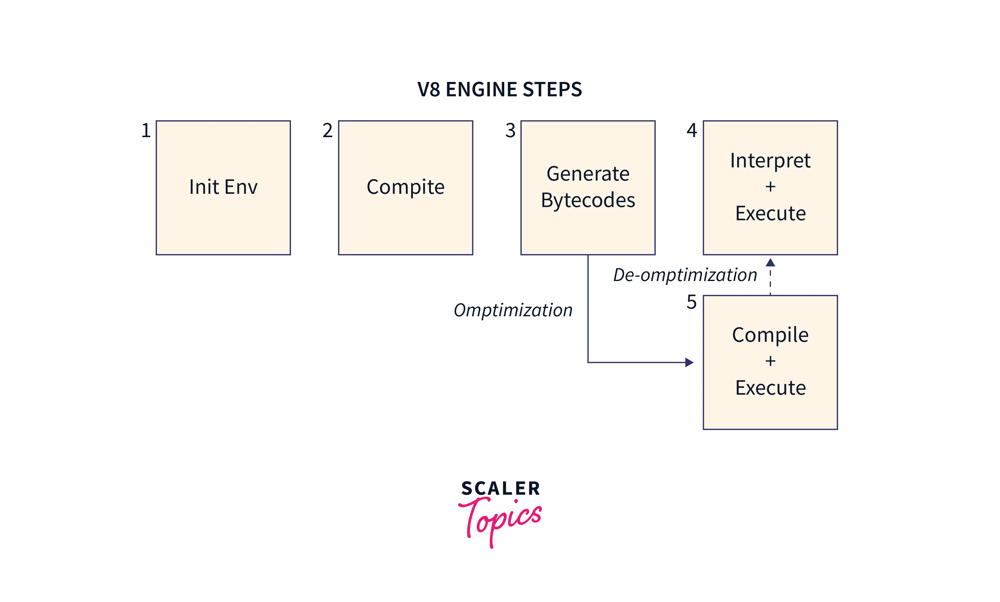
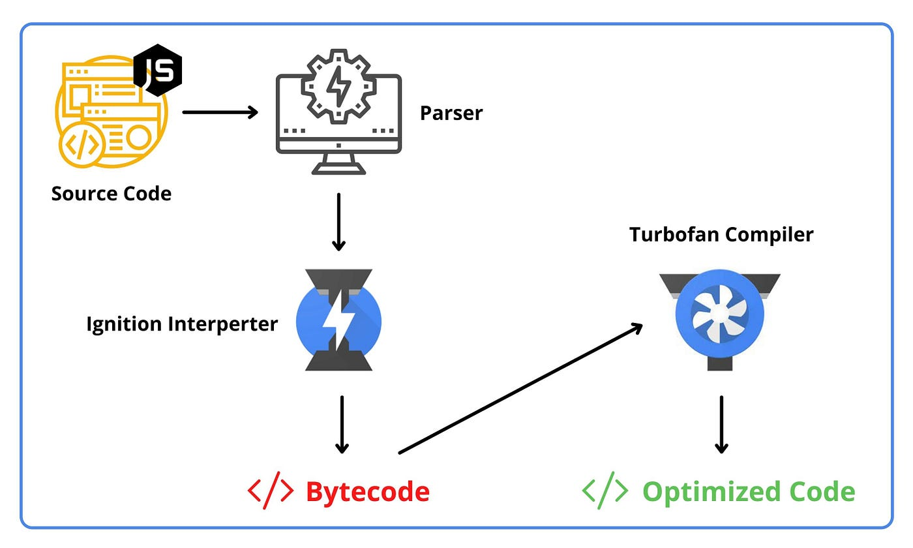

# ⚙️ Episode-08: Deep Dive into V8 JavaScript Engine

> 🧠 Understand the **V8 JavaScript Engine**, which powers Node.js and Chrome. Learn how JavaScript is parsed, interpreted, optimized, and executed — all behind the scenes.

---

## 🚦 V8 JavaScript Engine: Code Execution Phases

---

### 🧾 1. Parsing Stage

- **Lexical Analysis**  
  Breaks source code into tokens (keywords, variables, operators).

- **Syntax Analysis**  
  Converts tokens into an **Abstract Syntax Tree (AST)**, representing the code's structure.

---

### 🔥 2. Ignition (Interpreter)

- **Bytecode Generation**  
  AST is translated into bytecode — a simplified version of code.

- **Execution**  
  Bytecode is executed quickly by the Ignition interpreter (fast startup, not optimized).

---

### 📊 3. Profiling

- **Hotspot Detection**  
  V8 monitors which functions are used repeatedly ("hot functions").

- **Data Gathering**  
  This data helps decide what should be optimized.

---

### ⚡ 4. TurboFan (Optimizing Compiler)

- **Optimization**  
  Hot bytecode is converted to **highly optimized machine code** for better performance.

- **Deoptimization**  
  If runtime assumptions fail (like type changes), V8 can deoptimize back to bytecode for safety.

---

### ♻️ 5. Garbage Collection

- **Memory Cleanup**  
  V8 removes unused objects/data from memory to avoid memory leaks and bloat.

---

### 🧮 6. Final Execution

- Optimized code continues execution smoothly.
- If runtime behavior changes, V8 dynamically adapts using profiling and re-optimization.

---

## 🧠 Why This Matters

This step-by-step flow allows JavaScript to be:

- **Quick to start**
- **Optimized while running**
- **Efficient in memory usage**
- **Safe against dynamic code changes**

---

---

> 📚 Based on **Chapter 08** from [Akshay Saini](https://github.com/akshaymarch7)’s **Namaste Node.js** series.  
> 💡 Star the repo, learn the internals, and become a true Node.js engineer!
