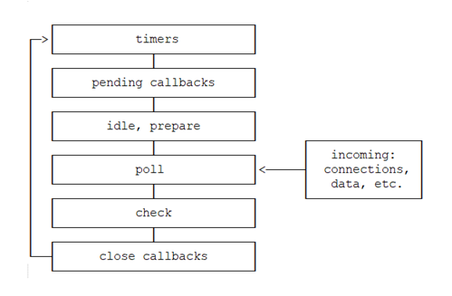

## 🚀 Diving into the Node.js Event Loop with libuv

### 🔄 1. Timers Phase ⏱️  
- Checks for expired `setTimeout`/`setInterval` callbacks.  
- Queues them for execution in the next loop iteration.

---

### 📡 2. I/O Polling Phase  
- libuv listens for completed I/O (file system, network).  
- Moves their callbacks into the ready queue immediately after polling.

---

### ⚡ 3. Immediate Callbacks Phase  
- Executes `setImmediate` callbacks right after the Poll phase.  
- Perfect for injecting work once all pending I/O has been handled.

---

### 🧹 4. Resource Cleanup Phase  
- Processes “close” events (e.g., sockets, handles).  
- Cleans up and releases resources before the loop restarts.

---

> **🛠️ Microtask Queue**  
> - **`process.nextTick()`**: Runs **before** the next phase, jumping to the front of the loop.  
> - **Promises** (`.then()`/`.catch()`): Run immediately after the current stack but **before** re-entering the event loop phases.

---

> _💡 When there’s nothing to do, libuv idles in the Poll phase, waiting for new events to drive the loop onward._
